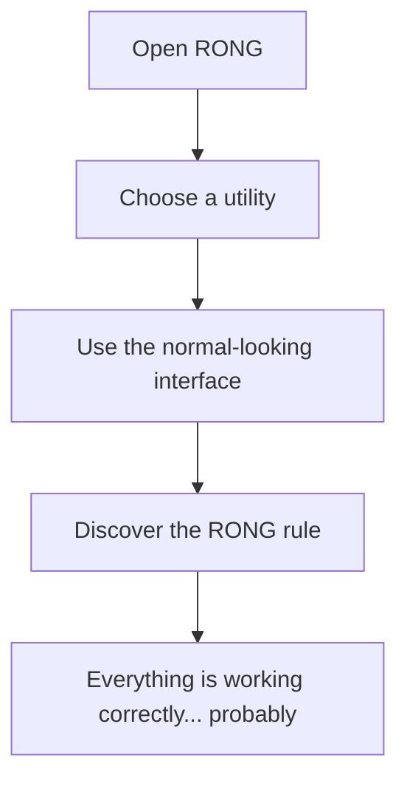

# RONG 🎯

> **Everything is working correctly.**

RONG is a Flutter utility app that looks normal, polished, and useful—until you use it.

Every utility follows one predictable but completely wrong rule. Nothing is broken. This phone is just RONG.

## Team

**Team Name:** Zeroza

- Sherin Saji — Sahrdaya College of Engineering and Technology
- Diya Joy — Sahrdaya College of Engineering and Technology

## The Problem (that doesn't exist)

Phones have become too reliable. Calculators calculate correctly, clocks understand time, and to-do lists let people finish tasks.

We decided that had to change.

## The Solution (that nobody asked for)

RONG provides a professional-looking collection of everyday phone utilities with one carefully engineered incorrect behavior in each feature.

The interface is normal. The interaction is normal. The rule is RONG.

## Features

| Utility | The RONG Rule |
| --- | --- |
| Calculator | Every answer is one more than the correct answer. |
| Clock | Hours, minutes, and seconds can reach `99`. |
| Flashlight | The flashlight works backwards. |
| To-Do | Completed and deleted tasks return. |
| Stopwatch | Time runs twice as fast. |
| Web Search | Every search gives zero results. |
| Camera | Taking a photo creates a cracked-screen effect. |
| Messages | Replies become strange and incorrect. |

## Tech Stack

- Dart
- Flutter
- Material Design 3
- `camera`
- `torch_light`
- Android Studio
- Visual Studio Code

## Getting Started

### Prerequisites

- Flutter SDK
- Android Studio with Android SDK
- Android emulator or Android phone with USB debugging enabled

### Installation

```bash
git clone https://github.com/diajoyy1111/zeroza.git
cd zeroza
flutter pub get
```

### Run the App

```bash
flutter run
```

### Build APK

```bash
flutter build apk --release
```

The release APK will be created here:

```text
build/app/outputs/flutter-apk/app-release.apk
```

## Screenshots


*The home screen presents familiar utilities and claims that everything is working correctly.*


*The calculator looks completely normal before revealing its wrong calculation rule.*


*The calculator returns a believable but incorrect answer.*


*Users can add and manage tasks like in a normal to-do app.*


*Deleted and completed tasks refuse to stay gone.*


*The clock displays impossible values while continuing to run normally.*

## Workflow



## Demo Video

[▶ Watch / download the RONG demo video](assets/demo/Rong-demo.mp4)

*The demo shows the RONG home screen and the incorrect behavior of multiple utilities.*

## Team Contributions

- **Sherin Saji:** Flutter UI design, screen development, styling, and testing.
- **Diya Joy:** App concept, functionality, RONG rules, and project integration.

---

> **RONG — Nothing is broken. This phone is just RONG.**
